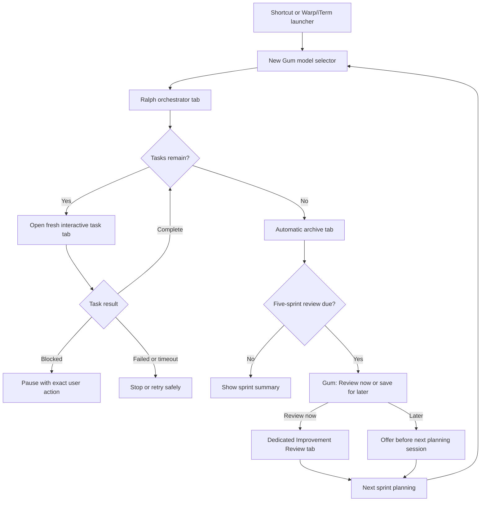

# Ralph Memory and Runtime Refactor

**Status:** Proposed

This plan incorporates the findings in [REFACTOR_PLAN_REVIEW.md](./REFACTOR_PLAN_REVIEW.md) and follow-up research against current Warp, Codex, Claude-Mem, and Anthropic documentation.

## Product decisions

- One Ralph product and shared runtime; do not fork Mac Ralph and Windows Ralph.
- Two thin setup entry points: `install-mac.sh` and `install-windows.ps1`.
- Tabbed UX is core: one orchestrator/control-tower tab, one fresh interactive tab per task, completed tabs retained for inspection, and a separate Improvement Review tab.
- Recommend iTerm on Mac and Warp on Windows, but do not bundle either terminal. Keep Terminal.app, Windows Terminal, and inline fallbacks.
- The user chooses Claude Code or Codex during setup. Every sprint still begins with the model selector for that coding agent.
- Claude-Mem captures evidence automatically. Ralph retains deterministic sprint state, metrics, archiving, and the periodic act of finding improvements.
- Existing retrospectives and sprint summaries remain unchanged and continue to inform future reviews.

## Target terminal workflow

The Gum model selector and automatic archive are target-state features; today the model menu is plain `read` input and archive is manual.

## Stage 0 — Stabilize the existing workflow

Create a measurable baseline before adding platforms:

- Fix portable dates and UUID generation in `scripts/ralph-continuous.sh` and `scripts/ralph-task-wrapper.sh`.
- Fix `./ralph.sh` with no arguments, unreachable timeout handling under `set -e`, failed agent exits being marked complete, stale/shared completion markers, and cleanup after interruption.
- Make `template/sprint_plan.md.template` and `skills/ralph-plan/SKILL.md` emit the checkbox format the orchestrator and metrics parser actually require.
- Ship the archive template and validator referenced by `skills/ralph-archive/SKILL.md`.
- Stop `scripts/install.sh` from deleting itself and establish a repair/upgrade path.
- Treat missing cost as unavailable, never `$0.00`; suppress savings/ROI calculations when source metrics are missing.
- Add baseline shell tests before extracting any adapters.

## Stage 0.5 — Validate the three risky integrations

Run executable spikes on actual target environments before finalizing adapters:

1. **Warp and WSL:** Warp Tab Configs cannot currently select a native WSL distribution. Test a Windows-side PowerShell Tab Config whose command launches the chosen distribution through `wsl.exe`, verify interactive Claude/Codex rendering, URI invocation, unique job claiming, and inline fallback when no tab claims the job.
2. **Codex skills:** Verify global folder symlinks under `~/.agents/skills/`, explicit `$ralph` invocation, `policy.allow_implicit_invocation: false`, dynamic session context without Claude’s `!command` expansion, and Ralph’s named subagent equivalents.
3. **Gum:** Verify Gum on macOS and inside the selected WSL distribution. Every Gum interaction must also have a plain-text fallback.

Do not ship Warp+WSL or claim Codex parity until these pass.

## Stage 1 — Package one shared core with two installers

- Extract shared configuration, portable date/UUID/path helpers, coding-agent launching, and terminal tab launching from `scripts/ralph.sh`, `scripts/ralph-continuous.sh`, and `scripts/ralph-task-wrapper.sh`.
- Replace the shared marker with an atomic UUID-keyed job/result record containing project, sprint/task ID, coding agent, model, reasoning, timestamps, state, and exit status. Include `claimed`, `completed`, `failed`, `timed-out`, and `user-extended` states.
- Keep a temporary `legacy` adapter switch until Mac+iTerm and Windows+Warp are proven.
- Store machine preferences—coding agent, terminal preference, last model, WSL distribution, Claude-Mem status—in `~/.ralph/config`. Keep project deploy/test/git settings in `ralph-config.md`; optionally allow a project to pin a coding agent.
- Parse project configuration through an explicit key allowlist rather than sourcing arbitrary shell from Markdown.
- Build one versioned runtime bundle and update it atomically so project launchers cannot remain stale.
- Add `install-mac.sh` for iTerm/Homebrew/Gum, agent detection, shortcut setup, and shared-core installation.
- Add `install-windows.ps1` for Warp/WSL detection, WSL distribution selection, Linux-side Gum and shared-core installation, Windows-side Tab Config placement under `%APPDATA%`, and optional Windows shortcut creation.
- Do not duplicate skills, templates, or orchestration between installers.

## Stage 2 — Preserve and improve the model-selector UX

- The setup-time coding-agent choice is remembered; the model is selected at every sprint kickoff.
- Replace the current numbered menu in `scripts/ralph-continuous.sh` with Gum when available and retain the previous choice as the highlighted default.
- Use a versioned provider-specific catalog. Claude displays supported Claude models. Codex displays Runtime Default and supported GPT-5.6 choices such as Sol, Terra, and Luna with model-valid reasoning options including `none`, `low`, `medium`, `high`, `xhigh`, and `max` where supported.
- Do not claim entitlement discovery: Codex provides no supported account-catalog API for Gum. Validate syntax and handle a valid-model/invalid-effort or plan rejection before task mutation by returning to the selector; never silently switch.
- Pass the exact coding agent, model, and reasoning choice to every task tab and record them in task metrics.
- Record token/cost data only from trustworthy machine-readable output. Interactive Codex may provide token visibility without a stable general-purpose cost feed; represent unavailable data honestly.

## Stage 3 — Consolidate archive and compounded review

- Wire `RALPH_AUTO_ARCHIVE` for real. After validated sprint completion, the orchestrator opens a dedicated archive tab; it does not ask the final task session to archive itself.
- Split responsibilities: deterministic shell code owns locking, max sprint-ID allocation, directories, state, retries, and atomic completion; the coding agent generates archive prose inside the prepared archive.
- Delete or replace archive steps 10 and 11 that currently write the shared symlinked `RALPH.md` and already generate overlapping multi-sprint insights. Migrate `.ralph/last_insights_sprint` into the new review state and retain existing `performance_insights.md` as evidence.
- Route accepted project patterns to the existing `## Stack Standards` section of project-owned `ralph-config.md`; route follow-up work to that project’s `roadmap.md`. Changes to Ralph’s shared kit require separate explicit confirmation.
- Track stable `lastArchivedSprint`, `lastReviewedSprint`, and pending review state. A deferred review remains due even if archive directories are renamed or removed.
- After every five newly archived sprints, show `Review now` or `Save for later`. `Review now` opens a dedicated conversational tab only after task execution and archiving end; it never competes with running sprint tasks.
- The review presents 3–5 evidence-backed recommendations with Apply/Edit/Skip choices, saves accepted recommendations, and evaluates their outcomes five sprints later.
- If deferred, offer the review before the next `/ralph-plan` or `$ralph-plan` session.

## Stage 4 — Integrate Claude-Mem

- Use the official `npx claude-mem install`; do not recreate its capture/database pipeline.
- For this setup, preselect Claude subscription authentication with Haiku compression, clearly stating that it consumes some shared Claude Pro allowance. Keep this one-time memory model separate from Ralph’s per-sprint coding model.
- For users without Claude authentication, offer Gemini or OpenRouter; Codex authentication cannot pay for Claude-Mem compression.
- Store credentials only in Claude-Mem’s supported files and discover its configured worker port; never hardcode a port.
- Verify three levels: worker health, hooks for the selected coding agent, and an end-to-end canary task that produces a searchable observation.
- Preserve fresh-task behavior with a compact project-filtered index, no previous full message/transcript, and on-demand detail retrieval. Test the context actually injected into Claude and Codex.
- Add a canonical project/sprint/task token to the initial task prompt and query memory using project, date range, and that searchable token; do not treat it as a structured database field.
- Pilot Haiku on representative Ralph sprints and compare Claude usage before/after. PostToolUse capture is asynchronous and may coalesce events, so measure actual allowance impact rather than assuming one model call per tool.
- Document that untagged tool input/output can be sent to the selected compression provider. Configure privacy tags and skipped tools for secrets and sensitive output.
- Claude-Mem failure never blocks building or archiving. Run due reviews from archived evidence, label missing memory coverage, and allow rerun after recovery.
- Preserve all historical retros and summaries; do not import them into Claude-Mem. Improvement Review reads them alongside newer memory.

## Stage 5 — Ship validated terminal and Codex adapters

- iTerm/Terminal.app use their existing AppleScript path behind the shared tab interface.
- Windows Terminal retains its `wt.exe` path.
- Warp uses the approach proven in Stage 0.5: a Windows-side static Tab Config runs a stable dispatcher, each launch claims one UUID-keyed job, URI dispatch must be claimed within a short timeout, and failure falls back inline.
- Install a searchable Warp workflow as a convenience, while documenting that workflows paste commands rather than guaranteeing immediate execution.
- Offer an optional direct Windows shortcut that invokes the Ralph orchestrator Tab Config; do not claim Warp supports binding a specific workflow directly to a custom key.
- Install Codex-compatible skills as symlinked folders under `~/.agents/skills/`, include `agents/openai.yaml` with implicit invocation disabled, invoke them explicitly with `$ralph*`, and keep Claude skills under `~/.claude/skills/`.
- Document any feature that cannot reach parity instead of hiding it behind an adapter.

## Stage 6 — Verification and documentation

- Test current-project upgrade, missing Gum, missing/unhealthy Claude-Mem, archive-only review, interrupted/duplicate archive, deferred review across restarts, user-extended conversations, failed/timed-out tabs, concurrent projects, model-effort rejection, and paths with spaces/Unicode.
- Manually validate the complete tab lifecycle on Mac+iTerm and Windows+Warp+WSL: shortcut, model selector, task tabs, intervention, retained history, archive tab, and Improvement Review tab.
- Validate Claude Code and Codex independently: instruction discovery, explicit invocation, new session/thread per task, model selection, Claude-Mem capture, and memory retrieval.
- Update `README.md`, `docs/README-MAC.md`, `docs/README-WINDOWS.md`, `docs/RALPH_CONFIG.md`, and `docs/EXAMPLES.md` to describe only demonstrated behavior.

## Delivery boundaries

Implement this as one coordinated product plan delivered through separate reviewable stages. Stage 0 and the three spikes are gates: later implementation choices must follow their evidence. Preserve existing Mac+iTerm behavior through the legacy switch until its replacement passes the full lifecycle. Windows support is new development, not an assumed migration.
