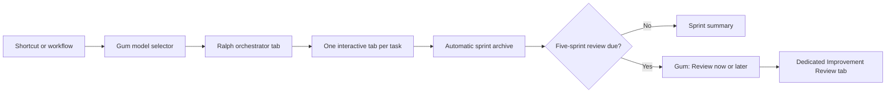
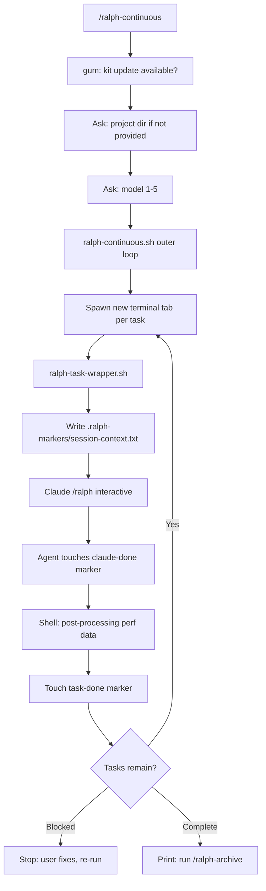
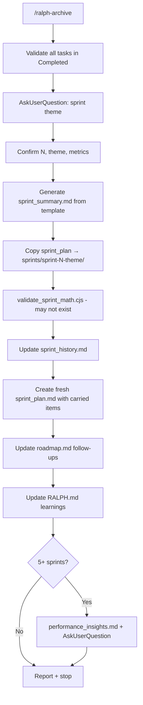

# Review: `ralph-memory-runtime-refactor` plan

Review of the proposed refactor that would make Ralph support Claude Code or Codex, recommend iTerm on Mac and Warp with WSL on Windows, integrate Claude-Mem, and add a five-sprint Improvement Review.

- **Reviewed against:** `main` at `095a52b`
- **Plan reviewed:** `ralph-memory-runtime-refactor` (Cursor artifact, `/opt/cursor/artifacts/plans/ralph_memory_runtime_refactor_24992478.plan.md` — not in this repo)
- **Method:** read the full repo, verified external claims against vendor docs, and executed the code paths in question

---

## Verdict

The product thinking is good. Separating machine-level choice from per-sprint choice, refusing to fake entitlement discovery, keeping Claude-Mem non-critical, and forbidding a project review from mutating the shared kit are all the right instincts.

But the plan will fail as written, for one structural reason and about a dozen specific ones.

**The structural reason:** the plan's central safety promise — *"Existing Claude+iTerm behavior must remain functional after every stage"* — is unverifiable, because **the current baseline is already broken on exactly the platforms the plan expands into.** This was confirmed by execution, not by reading. See [Verified bug inventory](#8-verified-bug-inventory).

The practical consequence: Windows is not a migration, it is new development. Every Windows bug encountered during the refactor will be ambiguous about whether the refactor introduced it.

---

## Contents

- [1. Provenance and epistemic status](#1-provenance-and-epistemic-status)
- [2. The diagrams](#2-the-diagrams)
- [3. Claims that are factually wrong](#3-claims-that-are-factually-wrong)
- [4. The baseline is already broken](#4-the-baseline-is-already-broken)
- [5. Product-model errors](#5-product-model-errors)
- [6. Metrics feed fabricated ROI](#6-metrics-feed-fabricated-roi)
- [7. Smaller risks](#7-smaller-risks)
- [8. Verified bug inventory](#8-verified-bug-inventory)
- [9. Recommended sequencing](#9-recommended-sequencing)
- [Appendix: verification commands](#appendix-verification-commands)

---

## 1. Provenance and epistemic status

The plan was produced by a tree of six cloud agents on this repo:

| Agent | Model | Role |
|---|---|---|
| Claude-mem retro efficiency | GPT-5.6 Sol | Authored the plan |
| Map Ralph user journey | composer-2.5-fast | Mapped current UX end to end |
| Scope runtime and terminals | composer-2.5-fast | Designed terminal/runtime adapters |
| Scope memory review migration | composer-2.5-fast | Designed Claude-Mem + Improvement Review |
| Audit plan technical accuracy | GPT-5.6 Sol | Technical audit |
| Audit plan product clarity | GPT-5.6 Sol | Product/wording audit |

### Nobody executed anything

This is the single most important thing to know about the plan's reliability.

| Agent | Shell commands run | Ralph scripts executed |
|---|---|---|
| Plan author | 2, read-only (`git log`, `gh issue view`) | none |
| Map user journey | 8, all `git` / `find` | none |
| Scope runtime & terminals | **0** | none |
| Scope memory & review | **0** | none |
| Audit technical accuracy | 2 (`git status`, `command -v codex` → empty) | none |
| Audit product clarity | **0** — one read of the plan, never opened a repo file | none |

No agent installed Codex, installed Claude-Mem, fired a `warp://` URI, or ran a single Ralph script. Every runtime claim in the plan is documentation-derived. The technical audit's own probe proved Codex was not even installed in its environment.

This is structural, not bad luck: every subagent was told *"Do not edit,"* and each interpreted that as *"do not execute."* The blind spot lines up precisely with the three questions **all six agents left unanswered** — Warp Tab Configs targeting WSL, Gum on Windows, and `--max-turns` / `set -e` behavior. All three turn out to be broken or unsupported.

> **Action:** give the next agent an environment with `codex`, `gum`, and `claude-mem` installed, and instruct it to execute. "Do not edit" and "do not run" are different instructions.

### The plan is not version controlled

It lives outside the repo, its internal references point at `/workspace/...`, and it has been rewritten twice — so every audit's line citations (e.g. "plan lines 46–47") refer to a draft that no longer exists. A plan describing this codebase should live in this codebase.

### The scoping docs are better than the plan

Several concrete decisions were solved during scoping and then lost in summarization (detailed in [§5](#5-product-model-errors)). Treat the scoping documents as the real design and the plan as its lossy summary.

---

## 2. The diagrams

Eight diagrams exist across the tree. The plan document itself contains exactly one.

### 2.1 The plan's diagram



This diagram is the clearest evidence of the plan's core problem. Read as a spec, five things stand out.

**One decision node, and it is the least risky decision in the system.** "Five-sprint review due?" is a modulo check. The prose contains roughly ten fallback requirements — Gum missing, Claude-Mem unavailable, model rejected at plan level, archive interrupted, review deferred across restarts, task tab failed or timed out, Warp URI never claimed. None appear. The happy path is the mental model; failure handling was appended during the audit pass rather than designed in. That is why the plan can promise no regressions while the baseline is broken — failure states are not where its attention is.

**There is no loop.** `TaskTabs → Archive` is a single arrow. The real product is a `while true` loop that re-checks remaining tasks after every task. The orchestrator's entire control structure — the thing being rewritten — is absent.

**Two of eight nodes describe things that do not exist.**
- `ModelSelector["Gum model selector"]` is not Gum. It is a plain numbered `read -p` menu in `scripts/ralph-continuous.sh`.
- `Archive["Automatic sprint archive"]` is not automatic. `RALPH_AUTO_ARCHIVE` is exported by two scripts and read by none.

The plan author made exactly this correction elsewhere when challenged on a mocked-up screen — *"You aren't getting that UI today — I was showing a proposed Gum screen, not an existing feature"* — but the diagram never received it.

**`/ralph-plan` is missing entirely**, despite the plan requiring that a deferred review be offered "before the next planning session via `skills/ralph-plan/SKILL.md`." That is a required edge with no node to attach to.

**It ends at `ReviewTab` with no return arrow.** The thesis is compounding improvement: reviews change standards, which change later sprints, which the next review evaluates. Drawn as a straight line, the feedback loop that justifies the project is not in the picture.

### 2.2 Current-state journey (from "Map Ralph user journey")

Five `flowchart TD` diagrams. This one is the most faithful representation of the product in the entire tree — and notably more accurate than the plan that followed it.



Note `D[Ask: model 1-5]` (the numbered menu, correctly drawn), the `M -->|Yes| F` loop, the `Blocked` branch, and the honest terminal state `O[Print: run /ralph-archive]` rather than "automatic archive."



`K[Update RALPH.md learnings]` and `L{5+ sprints?} → M[performance_insights.md]` are the symlink write-leak and the already-existing five-sprint review. Both were drawn in a diagram before the plan was written.

The remaining three (installation, planning, single-task build) are accurate but less load-bearing.

### 2.3 Memory and review architecture (from "Scope memory review migration")

The most detailed design in the tree. It answers two questions the final plan left open.

```mermaid
flowchart TB
  subgraph perTask [Per Task - Automatic]
    W[ralph-task-wrapper.sh] -->|writes| SC[session-context.txt]
    W -->|claude --session-id UUID| CC[Claude Code + claude-mem hooks]
    CC -->|PostToolUse| MEM[(claude-mem SQLite)]
    CC -->|SessionEnd summary| MEM
    W -->|run_post_processing| SP[sprint_plan.md metrics]
  end

  subgraph perSprint [Per Sprint Archive - Slim]
    AR[/ralph-archive] -->|query date range| MEM
    AR --> SS[sprint_summary.md performance + mem-sourced learnings]
    AR --> SH[sprint_history.md]
    AR --> RM[roadmap.md carry-forward]
  end

  subgraph every5 [Every 5 Sprints - Interactive]
    IR[/ralph-improvement-review] -->|search + timeline + get_observations| MEM
    IR -->|AskUserQuestion| USER[Human decisions]
    IR --> RC[ralph-config.md Stack Standards]
    IR --> RD[roadmap.md]
    IR --> PI[sprints/improvement_reviews/review-N.md]
  end

  AR -->|sprint_count mod 5 == 0| IR
  RP[/ralph-plan] -->|before planning| IR
```

Two things to take from this:

1. `IR --> RC[ralph-config.md Stack Standards]` is the concrete answer to a gap in the plan. The plan says accepted recommendations go to "project-owned configuration/instructions" — a file that does not exist. The scoping work correctly routes them to the `## Stack Standards` section of `ralph-config.md`, which is already read on every task. **Use that.**
2. This document explicitly designed the step-11 replacement (*"This **replaces** the current §11 logic"*) and the migration of `.ralph/last_insights_sprint` into a new `state.json`. The final plan dropped both.

Two defects in the diagram itself:
- `AR[/ralph-archive]`, `IR[/ralph-improvement-review]` and `RP[/ralph-plan]` will not render. `[/text/]` is Mermaid trapezoid syntax, and a leading `/` inside square brackets breaks the parse. Fix by quoting: `AR["/ralph-archive"]`.
- The trigger contradicts its own state schema: the edge says `sprint_count mod 5 == 0` (absolute) while the JSON it defines uses `sprintsSinceLastReview >= 5` (relative). These diverge the moment a review is deferred — which the design offers as a feature.

### 2.4 Adapter architecture (from "Scope runtime and terminals")

```
┌─────────────────────────────────────────────────────────┐
│  ralph-continuous.sh / ralph.sh / ralph-task-wrapper.sh │
└──────────────────────────┬──────────────────────────────┘
                           │
         ┌─────────────────┴─────────────────┐
         ▼                                   ▼
┌─────────────────────┐           ┌─────────────────────┐
│ terminal-adapters.sh │           │ runtime-adapters.sh │
│  detect + spawn      │           │  build argv + stats  │
└─────────────────────┘           └─────────────────────┘
         │                                   │
    iterm / terminal /                 claude / codex
    windows-terminal / warp / inline
```

A sound decomposition, and worth keeping close to as-is. But it **contradicts the final plan on the two highest-risk decisions**:

| Question | Runtime scoping doc | Final plan | Correct answer |
|---|---|---|---|
| Completion handoff | "Keep marker protocol **unchanged**" | "**Replace** the shared completion marker" | Replace — the shared marker has a verified race |
| Codex skills path | "likely `~/.codex/skills/` (confirm at implementation time)" | "its supported location" (unnamed) | `~/.agents/skills/`; `~/.codex/skills` is not discovered |

An implementer working from the scoping doc — which is far more actionable than the plan bullets — will preserve the racy marker protocol and install Codex skills into a directory Codex ignores. **Reconcile these before any code is written.**

### 2.5 Diagram-level recommendation

Before writing code, fix the plan's diagram to add: the task loop, the blocked branch, `/ralph-plan`, the return edge from review to next sprint, and the coding-agent choice — the single biggest change in the project, currently invisible. Relabel `ModelSelector` and `Archive` as new work.

---

## 3. Claims that are factually wrong

### 3.1 Warp Tab Configs cannot target WSL — this undercuts the Windows strategy

The plan's Windows path is "Tab Config runs a stable Ralph dispatcher" plus "use WSL as the supported Windows shell." **These two requirements are currently incompatible.**

`warp://tab_config/<file_stem>` is real and behaves as the plan describes, including `?new_window=true` and case-insensitive file-stem matching. That part is well researched. But Warp's Tab Config schema has no way to select a WSL distribution: `TabConfigPaneNode.shell` is an optional string, unknown pane fields are rejected, and the shell resolver does not match Warp's internal WSL shell entries. This is [Warp issue #12358](https://github.com/warpdotdev/warp/issues/12358), confirmed by Warp's own triage.

So a Tab Config pane on Windows starts in PowerShell 7 (Warp's Windows default), not WSL. Workarounds are both bad:
- Invoke `wsl.exe` as the pane command — fragile quoting, no native WSL session.
- Tell users to change their **global** "Startup shell for new sessions" — contradicts "detect and use them when installed, but do not bundle / take over."

**This is the single most likely reason the Windows half of the project slips.** Resolve it with a spike before committing to the design.

### 3.2 The URI launch is fire-and-forget, with no launch-failure detection

Firing `warp://...` hands off to a GUI app and returns nothing: no PID, no exit code. If Warp is not running, the Tab Config is missing, the scheme is unregistered, or the user is on Warp Preview (which needs `warppreview://`), the URI silently no-ops and the orchestrator waits the full timeout for a tab that never existed.

The job-claim design catches *task* failure but not *launch* failure. Add: **if the job is not claimed within N seconds, treat the launch as failed and fall back to inline.**

Also, from inside WSL there is no `open`. You need `cmd.exe /c start "" "warp://..."` or `wslview`, and the scheme must be registered by the Windows-side Warp install.

Finally, Warp Workflows *insert* a command into the input rather than running it, so the "`Ctrl+Shift+R`, search Ralph, press Enter" UX is optimistic. `Ctrl+Shift+R` is correct as the Workflows shortcut (`input:toggle_workflows`).

### 3.3 Codex custom prompts were removed; the skills location is wrong

The plan says Codex "installs compatible skills/instructions in its supported location." That vagueness will cost a sprint, because the obvious guesses are all wrong:

| What a developer would guess | Reality |
|---|---|
| `~/.codex/prompts/*.md` as `/prompts:ralph` | Deprecated, **removed** in codex-cli 0.117.0 |
| `~/.codex/skills/` | Not discovered ([issue #15939](https://github.com/openai/codex/issues/15939)) |
| **Correct** | `~/.agents/skills/<name>/SKILL.md` (global), `.agents/skills/` (repo), invoked as `$skill-name` |

Two consequences:

1. `~/.agents/skills` is a **shared cross-tool namespace**, so a skill named `ralph` is not namespaced to Codex. Collision risk.
2. This kit's entire install model is symlinks (`ln -s` from `~/.claude/skills/<name>` into the kit). **Whether Codex follows symlinked skill directories is unverified.** Make this an explicit spike — if it does not, Codex needs copies, which reintroduces the stale-copy problem todo #2 exists to eliminate.

Also: `disable-model-invocation: true` (used by all four Ralph skills) has no Codex equivalent. Codex skills are *designed* for implicit invocation, so on Codex, Ralph's skills can fire when the user did not ask. Document the difference rather than papering over it.

### 3.4 The model catalog is nearly right, with two gaps

Sol, Terra, and Luna are correct GPT-5.6 model names, and `xhigh` is real. But:

- The plan's list (`minimal, low, medium, high, xhigh`) omits `none` and `max`. `max` is the one users will want for hard debugging.
- Entitlements are not just per-model, they are **per model-and-effort combination**. On Plus, Sol only runs at medium effort and up. The selector will happily offer Sol + low and get rejected.

The plan's "return to the selector on rejection, never silently switch" handles this correctly. Just ensure the test case covers a **valid-model-but-invalid-effort** rejection, not only an invalid model.

### 3.5 Claude-Mem: mechanics right, economics wrong

Good news: `npx claude-mem install` genuinely detects Codex CLI alongside Claude Code, so "wire hooks for the selected coding agent" is achievable. The plan is also right that hooks live in `~/.claude/hooks.json`, that worker health needs verifying, and that an end-to-end canary beats a health check.

**Correction 1 — do not hardcode the worker port.** The default is per-user: `37700 + (uid % 100)`. Secondary sources say `37777` because that happens to be one user's value.

**Correction 2 — a Codex-only user would be forced into Claude.** The plan defaults Claude-Mem to the Claude Pro subscription with Haiku, and correctly notes Codex auth cannot power Claude-Mem. But it does not draw the product consequence: **a Codex-only user must install and authenticate Claude Code just to get memory**, which contradicts "one product" with a free agent choice. Claude-Mem supports Gemini and OpenRouter — make one of those the offered default when the selected agent is Codex.

**The real risk, absent from the plan:** Claude-Mem's compression and Ralph's coding agent draw on the **same Claude Pro quota**. Claude-Mem captures on `PostToolUse`; Ralph runs full sprints with `--dangerously-skip-permissions`, i.e. thousands of tool calls per sprint. **Enabling memory can throttle or halt the sprint it is supposed to be observing**, and the failure will look like Claude Code being slow, not like a memory problem. The plan treats this as a one-time billing disclosure. It needs a mitigation: a cheap non-Claude provider as the default, observation throttling, or an explicit "memory paused, quota low" state.

Two smaller blindspots:
- `~/.claude-mem/settings.json` is **global per user**, not per project. The plan's "project-scoped startup index" assumes control it may not have, and the `SessionStart` hook fires in every unrelated Claude Code session on the machine, diluting the Improvement Review's evidence base.
- "Fresh task" is a Ralph *policy*, but injection is enforced by Claude-Mem's hooks. The canary test must assert what actually landed in the session, not just that search works.

---

## 4. The baseline is already broken

All of the following were confirmed by execution. See [Appendix](#appendix-verification-commands).

### 4.1 The orchestrator dies before spawning a task on WSL, Linux, or Git Bash

`date -r <timestamp>` is BSD-only. On GNU coreutils, `-r` means "modification time of FILE," so it exits 1:

```bash
# scripts/ralph-continuous.sh, prepare_task_env()
date -r "$TASK_START_TS" '+%Y-%m-%d %H:%M:%S' > "$MARKER_DIR/task-${task_num}-start"
```

That is a standalone command under `set -euo pipefail`. Verified output: `date: 1787830965: No such file or directory`, exit 1.

`scripts/ralph.sh` already solved this with a `date_fmt` helper. `ralph-continuous.sh` and `ralph-task-wrapper.sh` never got the fix.

### 4.2 `uuidgen` is not guaranteed to exist

`ralph-task-wrapper.sh` depends on it for the session ID under `set -e`. It is absent in minimal Linux/WSL/Git Bash environments (verified missing in a standard container).

### 4.3 The orchestrator's timeout handler is dead code

`wait_for_completion` returns 1 on timeout. A `case` body is **not** exempt from `set -e`, so the script exits before reaching the error branch. Verified with a minimal repro: script exits 1, the `REACHED error handler` line never prints.

Consequences:
- The "Task #N failed or timed out" message has never been seen by a user.
- `rm -rf "$MARKER_DIR"` cleanup is skipped.
- Stale markers — including `sprint-complete` — survive into the next run, where `check_tasks_remain` immediately reports the sprint finished and Ralph silently does nothing.

### 4.4 `./ralph.sh` with no arguments fails

`[ "$1" == "--plan" ]` under `set -u` is an unbound variable error. This is the documented way to run a single task (`docs/README-WINDOWS.md` lists it as a key script).

### 4.5 Re-running setup is impossible

`scripts/install.sh` ends with `rm -- "$0"`, and `setup-project.sh` calls it. Anyone who has run setup once has no `install.sh`, so the second run dies at that line under `set -e`.

**The upgrade path for existing projects currently does not exist.** Every existing user is in a state where the repair tool has deleted itself. This makes todo #2's "existing-project upgrades" the hardest and least-specified item in the plan, not a footnote.

### 4.6 `RALPH_AUTO_ARCHIVE` is dead code

Exported at `ralph.sh:59,70` and `ralph-continuous.sh:368`; read nowhere. Meanwhile the skills and both platform READMEs describe archiving as automatic.

> Current state is the worst UX: documented automation that does not exist.

The plan's "automatic sprint archive" is therefore **net-new work, not a refactor** — which changes the size of todo #4.

### 4.7 The shipped sprint plan template uses the format the kit says does not work

`template/sprint_plan.md.template` emits numbered lists:

```
1. [#1] [Task name] - [Brief description]
   - Acceptance: [What "done" looks like]
```

`RALPH.md` says the opposite: *"Tasks must use bullet checkboxes. Ralph won't detect numbered lists."* `skills/ralph-plan/SKILL.md`'s generator template also emits numbered lists.

Concrete consequence: the wrapper's metrics counters grep for `- [x] **#N**`, so a numbered-format sprint yields `completed_count=0`, no performance lines, and zeroed totals — feeding the fabricated-ROI problem in [§6](#6-metrics-feed-fabricated-roi).

### 4.8 Archive dependencies never reach the project

- `sprints/scripts/validate_sprint_math.cjs` is invoked by `skills/ralph-archive/SKILL.md` and **does not exist anywhere in the kit**; setup never creates that directory.
- `sprint_summary.template.md` ships at `template/sprints/` but the archive skill reads it from `sprints/sprint_summary.template.md`, and setup copies only `sprint_history.md`.

Harmless today (an agent shrugs). Hard failures once archiving is automated and gated.

---

## 5. Product-model errors

### 5.1 Machine settings in a project-committed file

The plan saves `RALPH_RUNTIME` and `RALPH_TERMINAL` into each project's `ralph-config.md`. That file lives in the project repo and is **not gitignored**. But "which coding agent is installed" and "which terminal I use" are properties of a *machine*, not a project.

- Two people on the same repo overwrite each other's choices through git.
- One person on a Mac laptop and a Windows desktop cannot have both.
- `scripts/ralph.sh`'s exit trap runs `git add -A` and pushes to main, so this churns into commits automatically.

It also contradicts the plan's own framing: "detect and use them when installed" is runtime behavior, but saving `RALPH_TERMINAL` at setup freezes a runtime fact. The existing code detects `$TERM_PROGRAM` at launch for good reason — users start Ralph from VS Code, Cursor, Warp, or over SSH.

**Recommendation:** machine scope in `~/.ralph/config` (agent, terminal, model default, Claude-Mem state); project scope stays in `ralph-config.md` (deploy URL, validation commands, git). Allow a project to *pin* an agent for teams, but default to machine scope. Keep terminal detection at runtime, with the saved value as a preference rather than an override.

**Related:** `.gitignore` covers `*.log` but not `.ralph-markers/`, `.ralph/`, job records, result paths, or review reports. Combined with `git add -A` in the exit trap, the plan's new state files will be committed and pushed to users' main branches. Decide deliberately what is committed (review reports arguably should be) and ignore the rest.

### 5.2 The RALPH.md protection is half-applied and will break the auto-updater

"Never mutate the shared symlinked `RALPH.md` from a project review" is exactly right — `setup-project.sh` symlinks every project's `RALPH.md` to the kit, so one project's learning leaks into all projects.

But the plan only removes the **per-task** write from `skills/ralph/SKILL.md`. Two other writers remain:
- `skills/ralph-archive/SKILL.md` step 10 (sprint learnings)
- step 11 (performance patterns)

And the plan makes archiving **automatic**, so this goes from occasional to every sprint. Then it compounds: `check_for_updates` runs `git -C "$kit_dir" pull`. A kit with local `RALPH.md` modifications hits merge conflicts, so **the auto-updater starts failing for exactly the users running the most sprints.**

Note: the memory scoping doc *did* remove archive step 10 (*"§10 Update RALPH.md | Remove sprint learnings writes"*). The knowledge existed and was lost in summarization — a more fixable problem than an oversight, but it means the plan as written is not the best available thinking.

**Second gap:** "project-owned configuration/instructions" names no file, and none exists (`RALPH.md` is a symlink, `stdlib/` ships empty). Use `ralph-config.md`'s `## Stack Standards` section — already read on every task — plus `roadmap.md` for roadmap items. Do not invent a file nothing loads.

### 5.3 The Improvement Review already exists

`skills/ralph-archive/SKILL.md` step 11 is a five-sprint review with the same trigger (5 sprints), the same output shape (3–5 data-backed recommendations), the same interaction (`AskUserQuestion` apply/skip), and the same state concept (`.ralph/last_insights_sprint`).

The plan adds `skills/ralph-improvement-review/SKILL.md` and never mentions removing or merging step 11. Ship as written and users get two overlapping reviews, two state files that disagree, and two report artifacts.

The plan conflates "preserve existing retrospectives" (correct: keep past `sprint_summary.md` files) with "keep the redundant generator" (wrong).

> **Todo #4 should say explicitly:** delete archive steps 10 and 11, migrate `.ralph/last_insights_sprint` into the new state file, and have the new review read `sprints/performance_insights.md` as prior evidence.

**Also:** "every fifth sprint" derived from `lastArchivedSprint` inherits an unstable base. Sprint numbering comes from `ls -d sprints/sprint-* | wc -l` — a **count, not a max** — and the archive skill's own guidance tells users to rename or delete archive directories. Delete one archive and the next sprint reuses a number. Fix numbering at the source (max of parsed IDs, persisted in state).

### 5.4 "The orchestrator runs the archive" hides a design decision

The orchestrator is a bash script with no model. `ralph-archive` is a markdown skill needing an agent session (it uses `AskUserQuestion` for the theme and writes prose). So "the orchestrator runs an idempotent archive" actually means "the orchestrator spawns a dedicated archive tab" — using the same tab machinery being rewritten in stage 1. The plan never says this, and it affects sequencing.

Worse, the plan asks an LLM-driven markdown skill to guarantee idempotency. **Split it:** bash owns sprint ID derivation, directory creation, the lock/claim, and the state write (deterministic, testable by todo #5's shell tests); the agent only generates prose into a pre-created directory. As written, the "archive idempotency" test would be testing a language model.

### 5.5 No "human took over" state

The plan wants tabs interactive *and* wants "a failed, stale, or timed-out tab cannot advance a later task." But `docs/README-WINDOWS.md` actively teaches users to keep chatting in a completed tab, and the wrapper only signals done after the agent process exits. So a human extending a session is indistinguishable from a hang, and a 60-minute timeout fires mid-conversation.

The job record needs at least four states: claimed, completed, failed/timed-out, and **user-extended**. Also specify whether the orchestrator may advance while a user is still chatting in a finished tab — the plan specifies this for the review ("never in parallel with task tabs") but not for tasks.

---

## 6. Metrics feed fabricated ROI

The plan says metrics are provider-neutral and that "token counts and cost are present only when the coding agent exposes trustworthy machine-readable values." Right instinct, incomplete consequence.

Cost currently comes from `~/.claude/last-session-stats.json`, written by a statusline command **the kit never installs** — so cost is likely already unavailable for most users. Downstream, the wrapper defaults `total_cost` to `0.00`, and `skills/ralph-archive/SKILL.md` computes a business case from it:

```
Speed = 420 min / [actual duration]
Cost reduction % = 100 × (1 - [actual cost] / $350)
Savings = $350 - [actual cost]
```

With cost missing, that yields **"100% cost reduction, $350 saved"** per sprint, written into `sprint_summary.md` and `sprint_history.md`. The Improvement Review then reads those as evidence and produces recommendations grounded in fabricated numbers.

Since Codex will not expose cost the way the Claude statusline does, **adding Codex support actively increases the volume of fake ROI in the archive.**

Fix alongside the metrics work:
- Absent cost propagates as "unavailable," never `0.00`.
- Suppress business-case math when cost is missing.
- The review labels coverage gaps (the plan already does this for missing memory — apply the same discipline to missing cost).
- Decide whether wall-clock or agent-reported duration wins; the wrapper currently has both, and the stats file silently overrides wall clock.

Related: `--max-turns 50` in the wrapper is **print-mode only and ignored in interactive sessions**, so the existing safety cap is a no-op. Same for `--max-budget-usd`.

---

## 7. Smaller risks

**Gum will not exist on Windows.** Setup installs Gum via Homebrew — Mac-only, and it attempts a full unattended Homebrew install if brew is missing. On WSL there is no brew branch at all, so Gum will be absent precisely where the plan expands. The plan handles this for the review but todo #2 says "use Gum to select Claude Code or Codex" with no fallback — the one question the product hinges on. It also means `check_for_updates` silently no-ops on Windows, so Windows users never get updates. Add a plain-`read` fallback for every Gum prompt and install Gum via `winget`/`apt` on the Windows/WSL path.

**`scripts/ralph.sh` is unmentioned and will fossilize.** It is *copied* into every project (not symlinked) and independently hardcodes Claude model labels, per-minute cost estimates, and its own `SHELL_WILL_UPDATE` logic. Todo #1 names only `ralph-continuous.sh`. Every existing project already holds a stale copy. Either bring it into the adapter work or delete it and route everything through one entry point. (`template/ralph.config.sh.template` also looks like dead weight.)

**Symlink vs. versioned bundle is unresolved.** Todo #2 wants "one complete, versioned bundle... atomically," but the current model is deliberately symlinks so "changes are live instantly, no reinstall needed," and the updater is `git pull` on the kit. Pick one. If you keep symlinks, `git pull` must trigger a re-install for copied artifacts (`ralph-continuous.sh` in `~/Documents/ralph`, `ralph.sh` per project), or the stale-copy problem gets worse.

**No kill switch.** Stage 1 rewrites the concurrency model with no way back. Add `RALPH_ADAPTER=legacy` and keep the existing spawn path until Mac+iTerm and Windows+Warp are both proven. It is the cheapest way to make the plan's own no-regressions guardrail real rather than aspirational.

**"Control tower" oversells the orchestrator.** It prints dots. With unique job records you would finally have the data to render a real per-task status view (task ID, agent, model, elapsed, state) — the cheapest way to make the new architecture visibly better rather than just internally cleaner. Also decide what happens at 15+ retained tabs.

**Sourcing shell out of markdown.** Both `ralph-continuous.sh` and `ralph.sh` `sed` a fenced block out of `ralph-config.md` and `source` it. With Windows paths and user-supplied validation commands, quoting is fragile. Parse a whitelist of keys as data instead.

**Instruction layer is Claude-specific throughout.** `RALPH.md` prescribes Sonnet-vs-Opus and subagent usage and is symlinked into every project; `agents/*.md` are four Claude subagent definitions; `skills/ralph/SKILL.md` mandates `code-explorer` and `build-validator` by name at steps 4 and 8, and uses Claude-only `` !`command` `` shell pre-expansion at the top of the file. Todo #1 covers this in one bullet, which understates it: this is a rewrite of the instruction layer, and it is the work most likely to be silently skipped and then discovered as "Codex support doesn't really work."

---

## 8. Verified bug inventory

Pre-existing defects on `main` at `095a52b`. These are not introduced by the plan — they are what the plan promises to preserve.

| # | Bug | Location | Impact | How confirmed |
|---|---|---|---|---|
| 1 | `date -r <ts>` is BSD-only | `ralph-continuous.sh:189`, `ralph-task-wrapper.sh:53,458-459` | Orchestrator exits before first task on WSL/Linux/Git Bash | Executed |
| 2 | `uuidgen` not guaranteed | `ralph-task-wrapper.sh:73` | Wrapper exits under `set -e` | Executed |
| 3 | Timeout error path unreachable | `ralph-continuous.sh` main loop | Silent exit; stale markers persist; cleanup skipped | Executed repro |
| 4 | `./ralph.sh` no-arg fails | `ralph.sh:89` | Documented single-task entry point broken | Executed repro |
| 5 | Installer self-deletes | `install.sh:94` + `setup-project.sh:347` | Re-running setup is impossible; no upgrade path | Read + reasoning |
| 6 | `RALPH_AUTO_ARCHIVE` never read | `ralph.sh:59,70`, `ralph-continuous.sh:368` | Docs promise automation that does not exist | Grep (2 agents) |
| 7 | Shared `task-done` marker race | `ralph-continuous.sh` `wait_for_completion` | Fast completion erased → 60-min hang | Read + reasoning |
| 8 | Exit code swallowed | `ralph-task-wrapper.sh:415-435` | Failed task marked complete | Read + reasoning |
| 9 | Template format contradicts RALPH.md | `template/sprint_plan.md.template:13`, `skills/ralph-plan/SKILL.md` §8 | `completed_count=0`; zeroed metrics | Read (confirmed both files) |
| 10 | `validate_sprint_math.cjs` missing | `skills/ralph-archive/SKILL.md` §6 | Archive step references nonexistent file | `ls` — not found |
| 11 | `sprint_summary.template.md` never copied | `setup-project.sh:379-382` | Archive reads a file the project lacks | Read |
| 12 | Sprint number is a count, not a max | `skills/ralph-archive/SKILL.md` §3 | Deleting an archive reuses a sprint number | Read |
| 13 | `--max-turns` ignored interactively | `ralph-task-wrapper.sh:78` | Safety cap is a no-op | Vendor docs |
| 14 | Cost missing → 100% ROI | `ralph-task-wrapper.sh` + archive business case | Fabricated ROI in archive and history | Read + reasoning |
| 15 | `.gitignore` misses Ralph state | `.gitignore` | `git add -A` in exit trap pushes state to main | Read |
| 16 | Archive writes symlinked `RALPH.md` | `skills/ralph-archive/SKILL.md` §10, §11 | Cross-project leak + `git pull` conflicts | Read |
| 17 | `spawn_with_pty` is dead code | `ralph-continuous.sh:287` | Documented VS Code PTY mode never runs | Grep |

---

## 9. Recommended sequencing

The plan's five stages are reasonable. Restructure the front and de-risk the middle.

**Stage 0 — stabilize the baseline (new).**
Fix bugs 1–6 and 9–11 above on the current architecture. Land the shell test harness here. Without this, "no regressions" is unmeasurable and Windows work means debugging two eras of bugs at once.

**Stage 0.5 — spikes before committing.**
1. Can a Warp Tab Config launch into WSL, and can `warp://` be invoked from inside WSL? ([§3.1](#31-warp-tab-configs-cannot-target-wsl--this-undercuts-the-windows-strategy))
2. Does Codex follow symlinked skill directories in `~/.agents/skills`? ([§3.3](#33-codex-custom-prompts-were-removed-the-skills-location-is-wrong))
3. Is Gum installable and usable on Git Bash / WSL?

Each can invalidate a stage-2 design decision and each is cheap now, expensive later. Do these in an environment where `codex`, `gum`, and `claude-mem` are actually installed.

**Stage 1 — adapter extraction, behind `RALPH_ADAPTER=legacy`.**
Include the config-scope fix from [§5.1](#51-machine-settings-in-a-project-committed-file), since where `RALPH_RUNTIME`/`RALPH_TERMINAL` live changes the adapter interface. Reconcile the marker-protocol and Codex-path contradictions from [§2.4](#24-adapter-architecture-from-scope-runtime-and-terminals) first.

**Stage 2 — consolidate archive and review (moved ahead of Claude-Mem).**
Delete archive steps 10 and 11, fix sprint numbering, split bash/agent responsibilities, fix the ROI math. The review's value depends on trustworthy metrics and de-duplicated state; memory enhances evidence rather than founding it. This also ships the graceful-degradation path first and the enhancement second, so memory stops being a prerequisite.

**Stage 3 — Claude-Mem**, with a non-Claude compression provider as the default on the Codex path and explicit quota-contention handling.

**Stage 4 — Warp/Codex runtime support**, informed by the stage 0.5 spikes.

**Stage 5 — docs and cross-platform verification**, documenting the support level actually demonstrated.

---

## Closing note

The plan's strongest moments are its honest ones: *"do not claim Ralph can discover account entitlements," "document the support level actually demonstrated rather than assuming parity," "worker health alone is not sufficient proof."* Apply that same standard to the two things it currently asserts without evidence — that Warp+WSL works, and that the existing Claude+iTerm baseline is functional.

---

## Appendix: verification commands

Run on Linux (representative of WSL and Git Bash for these code paths).

**Bugs 1, 2, 10 — portability and missing validator:**

```bash
TS=$(date +%s)
date -r "$TS" '+%Y-%m-%d %H:%M:%S'; echo "exit=$?"
ls -la sprints/scripts 2>&1
command -v uuidgen || echo "uuidgen MISSING"
```

Output:

```
date: 1787830965: No such file or directory
exit=1
ls: cannot access 'sprints/scripts': No such file or directory
uuidgen MISSING
```

**Bug 3 — `set -e` swallows the timeout error path:**

```bash
#!/bin/bash
set -euo pipefail
wait_for_completion() { return 1; }   # simulates timeout
TERMINAL_TYPE=iterm
while true; do
  case $TERMINAL_TYPE in
    "iterm") wait_for_completion ;;
  esac
  EXIT_CODE=$?
  echo "REACHED error handler with EXIT_CODE=$EXIT_CODE"
  break
done
```

Output: `script exit=1`. The `REACHED error handler` line never prints — the error branch in `ralph-continuous.sh` is unreachable.

**Bug 4 — `ralph.sh` with no arguments:**

```bash
#!/bin/bash
set -euo pipefail
MODE="build"
if [ "$1" == "--plan" ]; then MODE="plan"; fi
echo "mode=$MODE"
```

Output: `line 3: $1: unbound variable`, `no-arg exit=1`. With `--plan`: `mode=plan`, exit 0.
